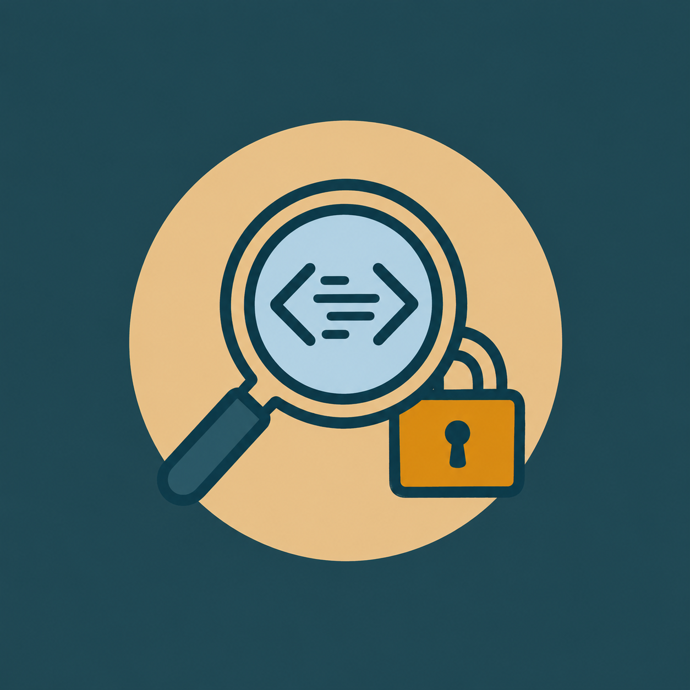
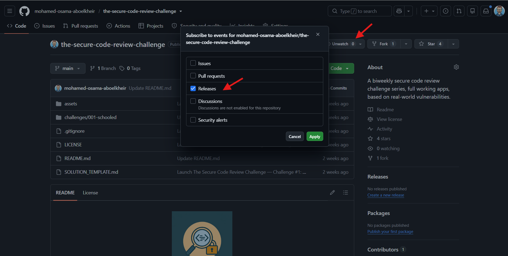

<p align="center">
  
</p>

<h1 align="center">The Secure Code Review Challenge</h1>

<p align="center">
  A free, recurring secure code review series for security engineers and developers.<br>
  Real applications. Real vulnerabilities.
</p>

---

## What this is

Every couple of weeks, this repo publishes a new **secure code review challenge**: a complete,
working, realistic application — not an isolated code snippet — that contains **one deliberately
planted, real-world-grounded vulnerability**. Each one comes with everything you need to run and
review it locally.

You review the whole application the way you would on the job — threat-model it, find the flaw,
prove it's exploitable, and propose a fix — then compare your reasoning against the published
solution when it drops.

## Who is this for

Anyone looking to practice secure code review in a way that resembles reviewing a real application,
rather than spotting bugs in small training snippets:

- **AppSec engineers**
- **Developers**
- **Pentesters, bug bounty hunters, and security researchers**

## Why

Current code examples focus on identifying the patterns that cause vulnerabilities in simple
training code samples. But in the real world, secure code review of a real application is a more
complex task: it means understanding the application's architecture and scope; identifying its entry
points, roles, and the vulnerabilities that are actually relevant to it; finding the right places in
the code to determine whether those vulnerabilities are mitigated; and, for any issue you find,
verifying whether it is genuinely exploitable and suggesting a fix.

That is why this series provides full, realistic applications with vulnerabilities based on real
security issues (e.g. CVE write-ups). It gives you an opportunity to practice the **full process** of
secure code review — training your judgment and building a methodology — rather than just learning to
recognize dangerous patterns.

It's the deliberate-practice companion to this methodology:
**[How to use AI for security code reviews](https://medium.com/appsec-untangled/how-to-use-ai-for-security-code-reviews-609440e6a16e)**.

## How each challenge works

- Each challenge lives in [`challenges/`](challenges/), one folder per round
  (e.g. [`challenges/001-schooled/`](challenges/001-schooled/)).
- The folder contains a `README.md` (the brief + how to run it) and the full application source.
- There is no multiple-choice list to guess from. You identify the vulnerability yourself and place
  it within the full space of vulnerability classes — which is what makes this a complete review
  exercise. (A reference catalog of vulnerability classes will live in the *AppSec Untangled* wiki,
  linked below — *coming soon*.)
- Work through the challenge using the suggested methodology, and record your findings in your own
  copy of the [solution template](SOLUTION_TEMPLATE.md).

## Suggested methodology

1. Understand the application's scope and architecture.
2. Identify the entry points (e.g. web pages and backend endpoints/routes).
3. Identify the dangerous sinks in the code and its dependencies (e.g. SQL queries, OS commands,
   HTML rendering).
4. Threat-model using two categories: **business-logic vulnerabilities** and **source-to-sink
   vulnerabilities**.
5. For each threat, determine whether it is mitigated in the code — and how / where.
6. Identify potential vulnerabilities and try to exploit them.
7. For each exploitable vulnerability, suggest a fix.

## Record your solution (privately)

**Copy the [`SOLUTION_TEMPLATE.md`](SOLUTION_TEMPLATE.md) into your own
private notes** and fill it in as you work through the challenge. Its fields follow the methodology
above.

Keeping your write-up private matters: **please don't post the vulnerability, exploit, or fix
publicly until the solution is released** — no spoilers in GitHub Issues or Discussions. Other people
are still working on it. Post-reveal discussion is very welcome once the solution drops.

## Cadence

A new drop lands **about every 2 weeks**. Each drop bundles:

- the **next** challenge, and
- the **full solution** to the previous challenge (the correct answer, why the plausible alternatives
  don't fit, the "why it looks safe" analysis, reproducible exploitation steps, the fix, and
  real-world CVE grounding).
- I will aslo demo the solution along with the steps i used to find it, exploit it, and fix it on my 
  YouTube Channel [@AppSecUntangled](https://www.youtube.com/@AppSecUntangled), and Medium Blog 
  [AppSec Untangled](https://medium.com/appsec-untangled)

Official solutions are published under [`solutions/`](solutions/), one folder per challenge
(e.g. [`solutions/001-schooled/SOLUTION.md`](solutions/001-schooled/SOLUTION.md)).

## Get notified — watch releases

Every drop — each new challenge **and** each solution reveal — is published as a **GitHub Release**
on this repo. Watching releases is the easiest way to know the moment a new one lands, without
getting notified for every issue, PR, or discussion.

1. Click **Watch** (top right of the repo) → **Custom**.
2. Check **Releases** only, then **Apply**.

<p align="center">
  
</p>

You'll get a notification (and can subscribe via the repo's Atom feed) whenever a new challenge or
solution release goes out — no need to keep checking back manually.

## Repository structure

```
.
├── README.md                     # you are here
├── SOLUTION_TEMPLATE.md          # copy this into your own notes per challenge
├── LICENSE
├── assets/                       # branding
├── challenges/
│   └── 001-schooled/             # the full, deliberately-vulnerable application
│       └── README.md             # the challenge brief + how to run it
└── solutions/                    # official solutions, published as GitHub Releases
    └── 001-schooled/
        └── SOLUTION.md
```

## ⚠️ Disclaimer

The applications in this repository contain **intentional, deliberately planted security
vulnerabilities** for educational use. They are meant to be run **locally**, in isolation, for
learning and practice only.

- **Do not** deploy them to any public, internet-facing, or production environment.
- Any secrets in a challenge's `.env.example` (JWT keys, DB passwords) are **throwaway dev values**
  to make each challenge runnable out of the box. Never reuse them anywhere real.

## License

[MIT](LICENSE) for the code. See the license notes regarding the intentional vulnerabilities.
